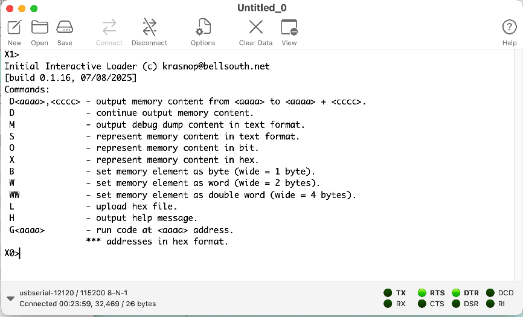
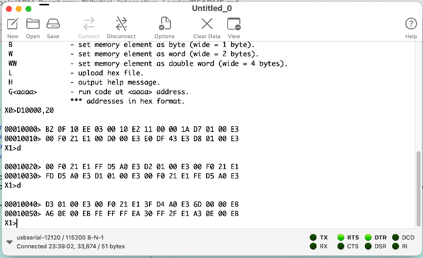
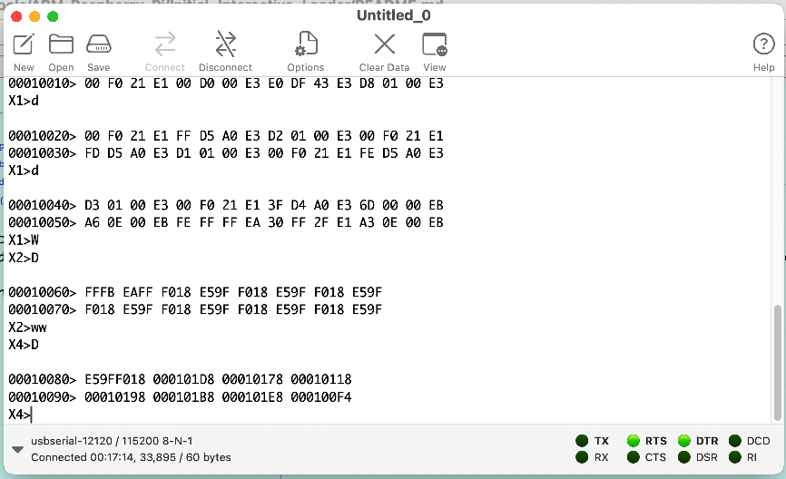
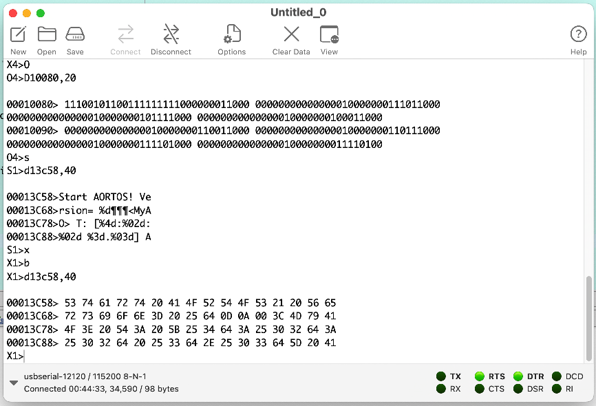
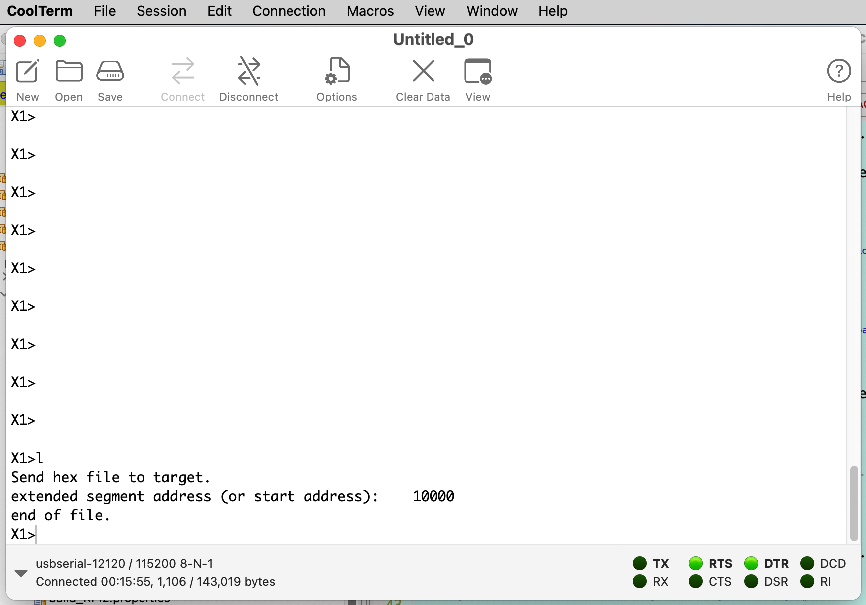
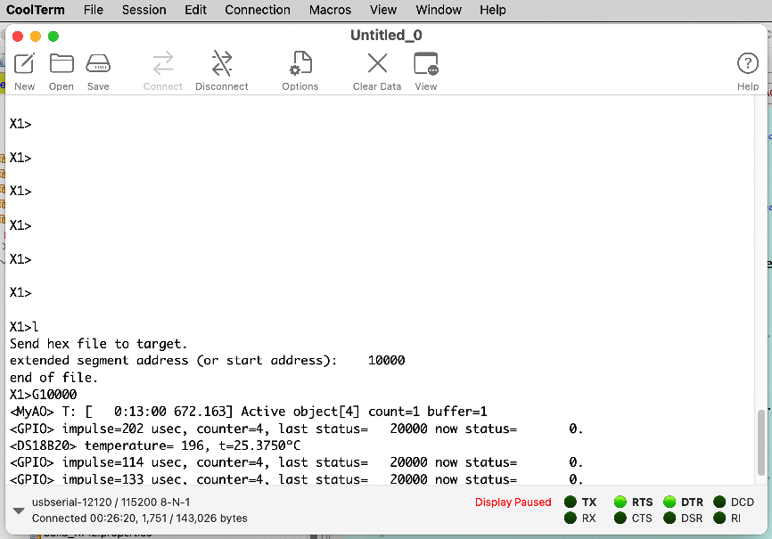
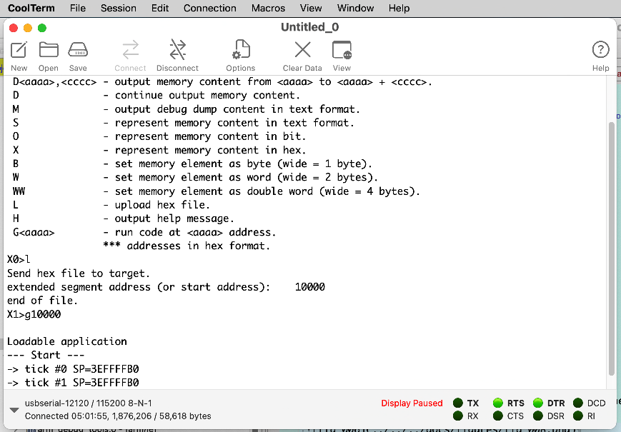
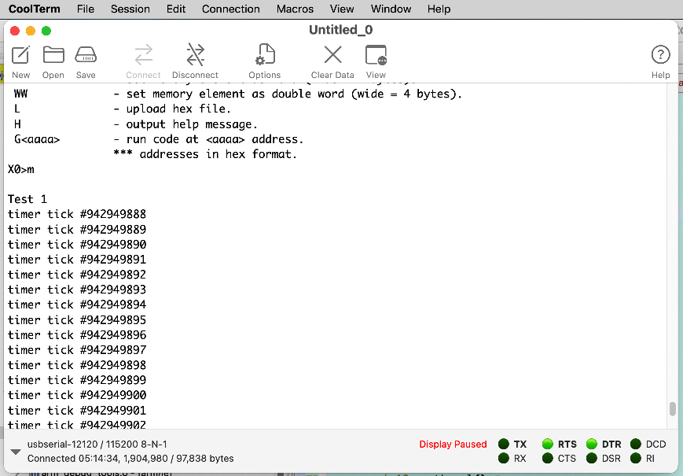
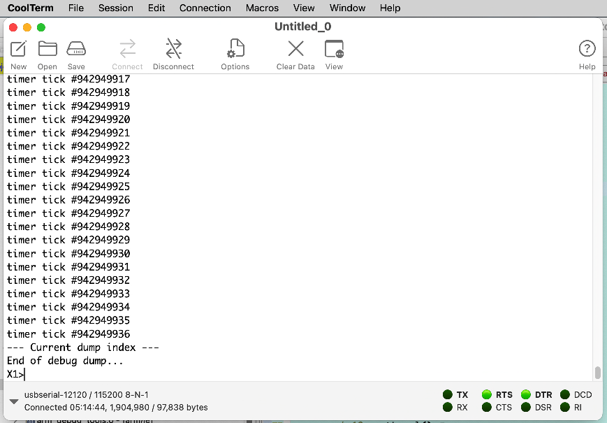

# Initial Interactive Loader

## Intents
 0. Convenient way to restart system
 1. Check memory content
 2. Upload an application in hex format to RPi memory
 3. Start application from given address
 4. Support debug an application

## Prearrangement
 1. Connect RPi to serial port of host computer. There are a lot of tutorials how establish serial connection to RPi online.
  Check, please, 
      - [David Welch github account](https://github.com/dwelch67/raspberrypi)
      - [Learning operating system development using Linux kernel and Raspberry Pi](https://github.com/s-matyukevich/raspberry-pi-os/tree/master)
      - [How to Connect to the Serial Port on a Raspberry Pi using a USB Adapter or TTL Converter](https://practicingelectronics.wordpress.com/2018/04/22/serial-port-for-a-raspberry-pi-using-a-usb-to-serial-adapter/)
      - [USB to TTL Serial Cable - Debug / Console Cable for Raspberry Pi](https://www.adafruit.com/product/954)
 2. Make reset button
 3. Prepare microSD. Put files from microSD-image.zip to your SD.
 4. Install [arm gnu toolchain](https://developer.arm.com/downloads/-/arm-gnu-toolchain-downloads). Change a Makefile (or build.xml for Ant builder) to reflect your installation folders.
 5. Install a serial port terminal. For Mac users I recomend CoolTerm is a simple serial port terminal application.
 
## Build and prepare to run
 1. Build image
     - cd ao.rtos.cpp/Tools/ARM-Raspberry_Pi/Initial_Interactive_Loader
     - make img
 2. Build microSD
     - copy file kernel.img to MicroSD
     - insert microCD to holder in RPi board and reset the target board.

## Run IIL
 After reset RPi (Interrupt power supply or using reset button) serial terminal shows image like this:

 

 It is easy to explain IIL operations by examples. To display content of RPi memory use the command 'D'. Memory content represents in bytes:
 
 
 
 To represent content in 2-byte words use command 'W'. Command 'WW' switchs memory view to 4-bytes words:
 
 
 
 Command 'O' shows content of memory as a bit string. To switch to text view type command 'S', then return to hex byte view:
 
 
 
 And most impotant IIL functionality is upload executable hex file to target RPi. Type 'L' to get message 'Send hex file to target.'. After that go to 'CoolTerminal' menu (or other serial terminal application you are using) and choose 'Connection->Send File(s)'. Find and click on file from you project folder (.../ao.rtos.cpp/_build/target/). Popup windows is appear 'Sending file ...' and then uploading will complete and window displays like this:
 
 

Now issue command 'G10000' and we can see view of running application:

 

## Debugging application with IIL

Idea how to log or save debugging messages from running application is simple. The main steps are:
 - Reserve memory area for writing debug messages;
 - Put in application source code statement to save debug messages;
 - Build and run application;
 - If application has stalled reset target RPi (do not interrupt power of target because it will destroy data in memory);
 - When IIL starting page is appear then type command 'M' and you can see all debug messages before application falls.
 
Let's illustrate it on sample application `ao.rtos.cpp/Tools/ARM-Raspberry_Pi/loadable-app`. To activate debugging availability include header file to main.cpp:

``` C
#include "arm_debug_tools.hpp"
```

and add to compile/link process source file `${PORTING_DIR}/arm_debug_tools.cpp`. Start debugging tools and log first message in main.cpp

``` c
main.cpp
  dump_debug_init();
  dump_debug_message("Test 1\n\r");
```

In `periph_timers.cpp` add more debug messages:

``` c
  fp.format(out, "timer tick #%d\n\r", tic);
  dump_debug_message(out);
```
Now build our sample application:

``` bash
cd ao.rtos.cpp/Tools/ARM-Raspberry_Pi/loadable-app
make hex
```
Go to serial terminal window and upload LoadableApp.hex file to target. Run application:

 

Now interrupt execution of application on target by pushing reset button (NOT power socket).
After IIL restart issue command 'm'. You can see debugging messages:
 
 

## Functionality Explanation 